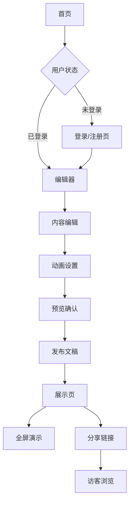

## 1. 产品概述
职场展示类幻灯片网页，专为商务演示和职场汇报设计的专业展示平台。通过流畅的页面切换动画和专业的视觉设计，帮助用户创建令人印象深刻的在线演示文稿。

解决传统PPT文件分享不便、动画效果单一的问题，为职场人士提供便捷的专业演示解决方案，适用于项目汇报、产品发布、培训讲解等商务场景。

## 2. 核心功能

### 2.1 用户角色
| 角色 | 注册方式 | 核心权限 |
|------|----------|----------|
| 访客用户 | 无需注册 | 浏览公开演示文稿 |
| 注册用户 | 邮箱注册 | 创建、编辑、管理个人演示文稿 |
| 高级用户 | 付费升级 | 解锁高级动画模板、数据分析功能 |

### 2.2 功能模块
职场幻灯片展示网页包含以下核心页面：
1. **首页**：品牌展示、模板预览、功能介绍、用户登录入口
2. **编辑器**：幻灯片编辑、动画设置、内容管理、预览功能
3. **展示页**：全屏演示、导航控制、动画播放、备注显示
4. **管理后台**：文稿列表、数据统计、模板管理、用户设置

### 2.3 页面详情
| 页面名称 | 模块名称 | 功能描述 |
|----------|----------|----------|
| 首页 | 英雄区域 | 展示主要产品价值，包含动态背景和专业标语 |
| 首页 | 模板展示 | 轮播展示精美模板，支持分类筛选和预览 |
| 首页 | 功能特性 | 图文并茂展示核心功能，包含动画演示 |
| 首页 | 登录注册 | 提供简洁的登录注册表单，支持第三方登录 |
| 编辑器 | 幻灯片管理 | 左侧缩略图导航，支持拖拽排序和新增删除 |
| 编辑器 | 内容编辑 | 富文本编辑器，支持插入图片、图表、视频 |
| 编辑器 | 动画设置 | 提供多种专业动画效果，支持自定义时长和缓动 |
| 编辑器 | 实时预览 | 右侧预览窗口，实时显示编辑效果和动画 |
| 展示页 | 全屏演示 | 支持全屏模式，优化显示比例和字体大小 |
| 展示页 | 导航控制 | 底部进度条，支持键盘快捷键和触摸手势 |
| 展示页 | 动画播放 | 平滑的页面切换动画，支持自定义转场效果 |
| 展示页 | 演讲备注 | 可选显示演讲者备注，仅对演讲者可见 |
| 管理后台 | 文稿列表 | 网格/列表视图展示所有文稿，支持搜索筛选 |
| 管理后台 | 数据统计 | 展示文稿浏览量、分享次数等关键指标 |
| 管理后台 | 模板管理 | 管理个人模板库，支持导入导出功能 |
| 管理后台 | 账户设置 | 个人信息管理、订阅状态、使用偏好设置 |

## 3. 核心流程

### 用户创建演示文稿流程
用户访问首页 → 浏览模板库选择模板 → 注册/登录账户 → 进入编辑器创建内容 → 设置动画效果 → 预览确认 → 发布生成分享链接 → 进入展示页进行演示

### 访客浏览演示文稿流程
访客通过分享链接访问 → 进入展示页 → 自动播放或手动控制 → 体验平滑动画切换 → 可选择全屏模式获得更佳体验

## 4. 用户界面设计

### 4.1 设计风格
- **主色调**：深蓝色(#1E3A8A)搭配白色，体现专业商务感
- **辅助色**：橙色(#F59E0B)作为强调色，用于按钮和重要元素
- **按钮样式**：圆角矩形设计，悬停时有轻微阴影效果
- **字体选择**：中文使用思源黑体，英文使用Inter，标题24-32px，正文16px
- **布局风格**：卡片式布局，留白充足，突出内容层次
- **图标风格**：使用线性图标，简洁现代，保持视觉一致性

### 4.2 页面设计概览
| 页面名称 | 模块名称 | UI元素 |
|----------|----------|----------|
| 首页 | 英雄区域 | 深蓝色渐变背景，白色大标题32px，副标题18px，CTA按钮橙色圆角 |
| 首页 | 模板展示 | 卡片网格布局，3列展示，卡片悬停上浮效果，包含预览按钮 |
| 编辑器 | 幻灯片管理 | 左侧边栏240px宽，缩略图列表，当前选中高亮蓝色边框 |
| 编辑器 | 内容编辑 | 中央编辑区域，白色背景，工具栏顶部悬浮，支持拖拽调整元素 |
| 展示页 | 全屏演示 | 黑色背景，内容居中显示，底部半透明控制栏，支持手势操作 |
| 展示页 | 动画效果 | 平滑的淡入淡出、滑动、缩放等转场动画，时长0.5-1秒 |

### 4.3 响应式设计
采用桌面端优先设计策略，确保在大屏幕上获得最佳展示效果。平板端保持核心功能完整，优化触摸操作体验。移动端提供简化的浏览模式，重点优化内容可读性和基础导航功能。所有动画效果在不同设备上保持一致性，确保专业展示品质。

### 4.4 动画设计指导
- **页面切换**：采用平滑的滑动和淡入淡出效果，避免突兀的视觉跳跃
- **元素动画**：支持文字逐行显示、图片渐进式加载、图表动态绘制
- **转场时长**：控制在0.3-0.8秒之间，确保观众有足够时间消化内容
- **缓动函数**：使用ease-in-out实现自然的加速减速效果
- **性能优化**：使用CSS3硬件加速，避免复杂动画导致的卡顿