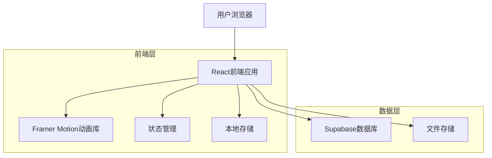
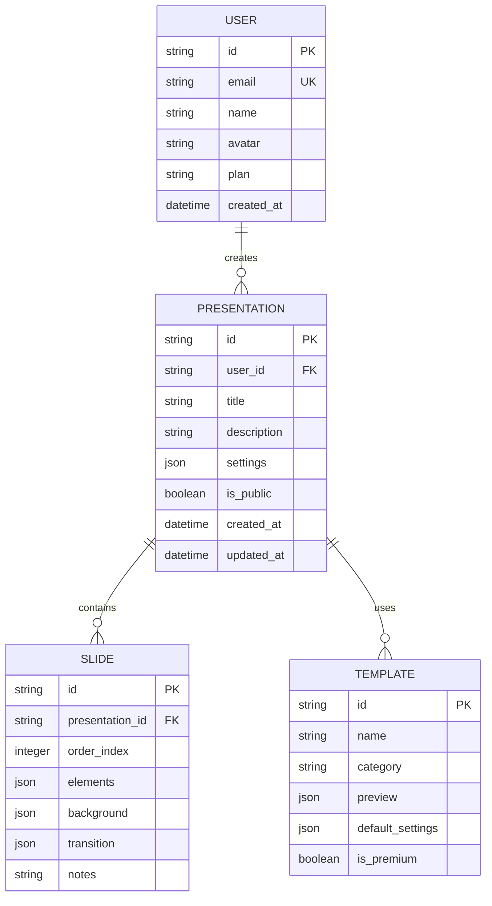

## 1. 架构设计



## 2. 技术描述

- **前端框架**: React@18 + TypeScript + Vite
- **初始化工具**: vite-init
- **样式方案**: Tailwind CSS@3 + CSS Modules
- **动画库**: Framer Motion + GSAP
- **状态管理**: Zustand
- **路由**: React Router@6
- **UI组件**: Headless UI + Radix UI
- **图表库**: Chart.js + react-chartjs-2
- **富文本编辑器**: Quill.js
- **后端服务**: Supabase (PostgreSQL + Storage)
- **部署方案**: Vercel/Netlify

## 3. 路由定义

| 路由路径 | 功能描述 |
|----------|----------|
| / | 首页，展示产品特色和模板 |
| /login | 用户登录页面 |
| /register | 用户注册页面 |
| /editor | 幻灯片编辑器主界面 |
| /editor/:id | 编辑指定ID的文稿 |
| /present/:id | 展示指定ID的文稿 |
| /dashboard | 用户管理后台 |
| /templates | 模板库页面 |
| /settings | 用户设置页面 |

## 4. 核心组件架构

### 4.1 动画组件系统
```typescript
// 页面切换动画组件
interface SlideTransitionProps {
  children: React.ReactNode;
  direction: 'horizontal' | 'vertical';
  duration?: number;
  easing?: string;
}

// 元素动画组件
interface ElementAnimationProps {
  type: 'fadeIn' | 'slideIn' | 'scale' | 'rotate';
  delay?: number;
  trigger?: 'onView' | 'onClick' | 'onHover';
}
```

### 4.2 编辑器核心API
```typescript
// 幻灯片数据结构
interface Slide {
  id: string;
  elements: SlideElement[];
  background: BackgroundConfig;
  transition: TransitionConfig;
  notes?: string;
}

interface SlideElement {
  id: string;
  type: 'text' | 'image' | 'chart' | 'video';
  content: any;
  position: { x: number; y: number };
  size: { width: number; height: number };
  animation: ElementAnimation;
}
```

### 4.3 展示播放器API
```typescript
// 播放器状态管理
interface PlayerState {
  currentSlide: number;
  totalSlides: number;
  isPlaying: boolean;
  isFullscreen: boolean;
  progress: number;
}

// 播放控制接口
interface PlayerControls {
  play(): void;
  pause(): void;
  next(): void;
  previous(): void;
  goToSlide(index: number): void;
  toggleFullscreen(): void;
}
```

## 5. 性能优化策略

### 5.1 动画性能
- 使用CSS3 transform和opacity属性实现动画
- 启用GPU硬件加速
- 使用requestAnimationFrame优化动画帧率
- 实现动画预加载机制

### 5.2 资源优化
- 图片懒加载和WebP格式支持
- 视频流式加载和分段加载
- 组件级代码分割
- 使用React.memo优化重渲染

### 5.3 存储优化
- 本地缓存常用模板和素材
- IndexedDB存储大型媒体文件
- Service Worker实现离线功能
- 增量同步机制

## 6. 数据模型

### 6.1 核心数据表结构


### 6.2 数据库DDL
```sql
-- 用户表
CREATE TABLE users (
  id UUID PRIMARY KEY DEFAULT gen_random_uuid(),
  email VARCHAR(255) UNIQUE NOT NULL,
  name VARCHAR(100) NOT NULL,
  avatar VARCHAR(500),
  plan VARCHAR(20) DEFAULT 'free' CHECK (plan IN ('free', 'premium', 'enterprise')),
  created_at TIMESTAMP WITH TIME ZONE DEFAULT NOW(),
  updated_at TIMESTAMP WITH TIME ZONE DEFAULT NOW()
);

-- 演示文稿表
CREATE TABLE presentations (
  id UUID PRIMARY KEY DEFAULT gen_random_uuid(),
  user_id UUID REFERENCES users(id) ON DELETE CASCADE,
  title VARCHAR(200) NOT NULL,
  description TEXT,
  settings JSONB DEFAULT '{}',
  is_public BOOLEAN DEFAULT false,
  view_count INTEGER DEFAULT 0,
  created_at TIMESTAMP WITH TIME ZONE DEFAULT NOW(),
  updated_at TIMESTAMP WITH TIME ZONE DEFAULT NOW()
);

-- 幻灯片表
CREATE TABLE slides (
  id UUID PRIMARY KEY DEFAULT gen_random_uuid(),
  presentation_id UUID REFERENCES presentations(id) ON DELETE CASCADE,
  order_index INTEGER NOT NULL,
  elements JSONB DEFAULT '[]',
  background JSONB DEFAULT '{}',
  transition JSONB DEFAULT '{"type": "fade", "duration": 0.5}',
  notes TEXT,
  created_at TIMESTAMP WITH TIME ZONE DEFAULT NOW()
);

-- 模板表
CREATE TABLE templates (
  id UUID PRIMARY KEY DEFAULT gen_random_uuid(),
  name VARCHAR(100) NOT NULL,
  category VARCHAR(50) NOT NULL,
  preview JSONB DEFAULT '{}',
  default_settings JSONB DEFAULT '{}',
  is_premium BOOLEAN DEFAULT false,
  download_count INTEGER DEFAULT 0,
  created_at TIMESTAMP WITH TIME ZONE DEFAULT NOW()
);

-- 创建索引
CREATE INDEX idx_presentations_user_id ON presentations(user_id);
CREATE INDEX idx_presentations_created_at ON presentations(created_at DESC);
CREATE INDEX idx_slides_presentation_id ON slides(presentation_id);
CREATE INDEX idx_slides_order_index ON slides(order_index);
CREATE INDEX idx_templates_category ON templates(category);

-- 权限设置
GRANT SELECT ON users TO anon;
GRANT ALL PRIVILEGES ON users TO authenticated;
GRANT SELECT ON presentations TO anon;
GRANT ALL PRIVILEGES ON presentations TO authenticated;
GRANT SELECT ON slides TO anon;
GRANT ALL PRIVILEGES ON slides TO authenticated;
GRANT SELECT ON templates TO anon;
```

## 7. 部署配置

### 7.1 环境变量
```env
VITE_SUPABASE_URL=your_supabase_url
VITE_SUPABASE_ANON_KEY=your_supabase_anon_key
VITE_APP_URL=https://your-domain.com
VITE_MAX_FILE_SIZE=10485760
VITE_ALLOWED_FILE_TYPES=jpg,jpeg,png,gif,mp4,mp3
```

### 7.2 构建优化
- Vite配置优化，提升构建速度
- 图片压缩和格式转换
- 代码分割和懒加载
- CDN加速静态资源